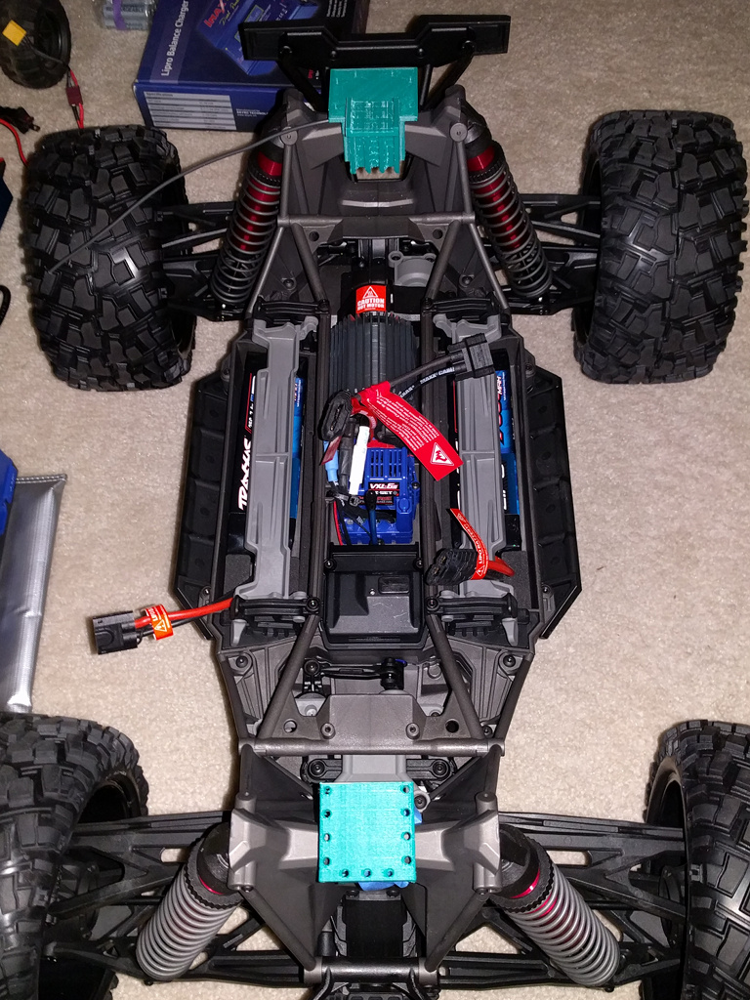
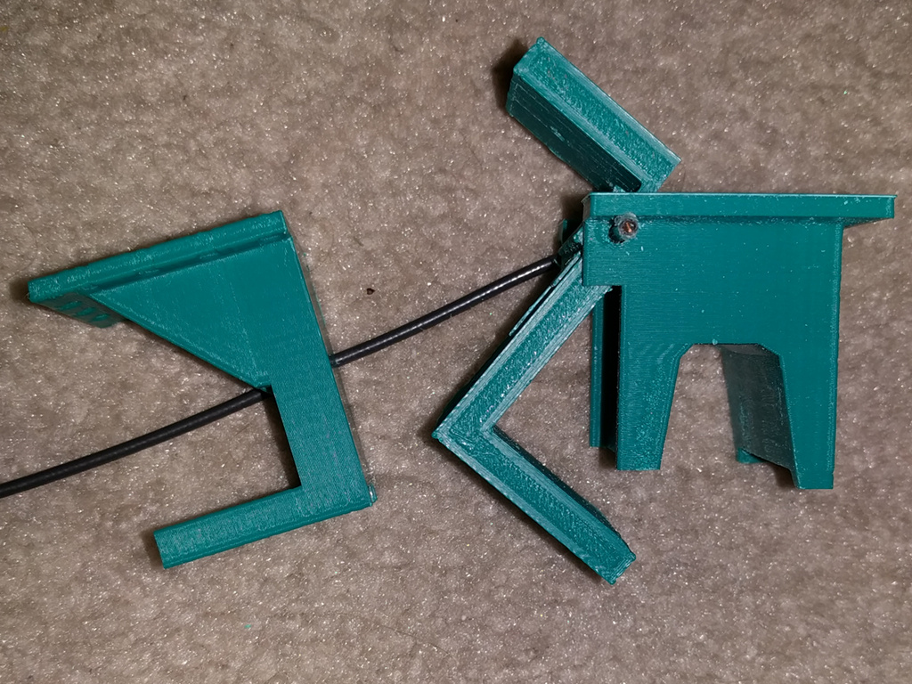

# 3D Models of Different Parts

I plan to 3D-print a couple of part. This shall become the place to collect them.

* Three pieces to hold the `Robotics Platform`. They were inspiried by the mounting of the original shell. But my versions
  are crude in comparision but they seem to work;-)
  
  

